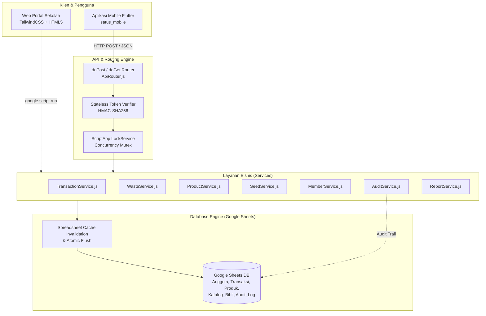
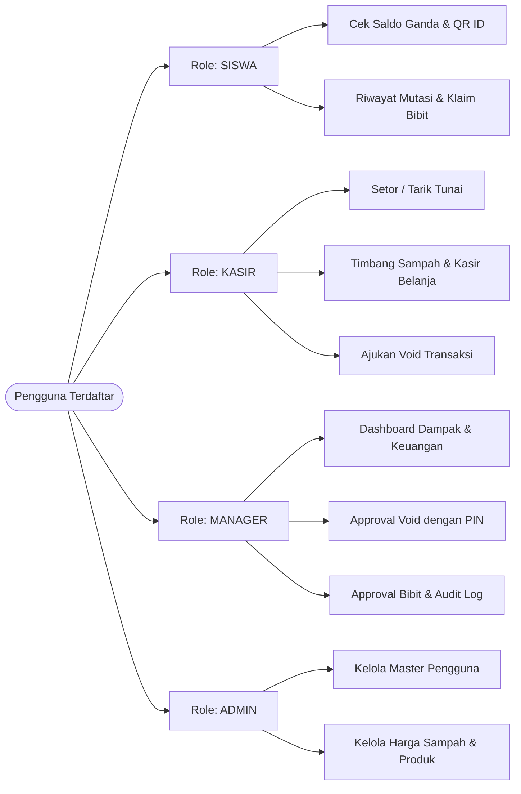

<div align="center">

  

  # 🌱 SATUS (Satu Tabungan Untuk Siswa)
  ### **Backend Service, Database Engine & Cooperative Web Portal**
  *Sistem Ekosistem Tabungan Digital & Ekonomi Sirkular Koperasi Sekolah (Kantong Hijau)*

  [](https://developers.google.com/apps-script)
  [](https://www.google.com/sheets/about/)
  [](https://tailwindcss.com/)
  [](#-fitur-keamanan--keandalan-sistem)
  [](#)
  [](#)

  <br/>

  

  <br/><br/>

  <p align="center">
    <b>SATUS</b> adalah platform tata kelola keuangan mikro dan ekonomi sirkular sekolah terintegrasi.<br/>
    Mengubah sampah terpilah siswa menjadi tabungan dan bibit penghijauan, didukung backend serverless berkinerja tinggi serta frontend web yang responsif.
  </p>

</div>

---

## 📌 Daftar Isi
- [🌱 Tentang SATUS](#-tentang-satus)
- [💡 Konsep "Kantong Hijau" (Dual Balance)](#-konsep-kantong-hijau-dual-balance)
- [🏗️ Arsitektur Sistem](#️-arsitektur-sistem)
- [🛡️ Fitur Keamanan & Keandalan Sistem](#️-fitur-keamanan--keandalan-sistem)
- [👥 Pembagian Peran & Hak Akses (Role-Based)](#-pembagian-peran--hak-akses-role-based)
- [💻 Modul & Layanan Backend](#-modul--layanan-backend)
- [🌐 Web Portal Frontend](#-web-portal-frontend)
- [📡 Dokumentasi API Mobile](#-dokumentasi-api-mobile)
- [🚀 Panduan Instalasi & Deployment](#-panduan-instalasi--deployment)
- [📁 Struktur Direktori](#-struktur-direktori)
- [📜 Lisensi & Penghargaan](#-lisensi--penghargaan)

---

## 🌱 Tentang SATUS

**SATUS (Satu Tabungan Untuk Siswa)** lahir dari inisiatif pelestarian lingkungan dan edukasi finansial di lingkungan **SMP Muhammadiyah 1 Magetan**. Proyek ini mengawinkan gerakan **Zero Waste Sekolah** dengan **Koperasi Siswa Digital**.

Melalui SATUS, siswa tidak hanya belajar menabung uang secara konvensional, namun juga diajak memilah sampah rumah tangga maupun sekolah (seperti botol plastik, kertas karton, minyak jelantah, dan kaleng logam) untuk ditimbang di koperasi sekolah. Hasil timbangan sampah secara otomatis dikonversi menjadi saldo poin hijau yang dapat digunakan untuk belanja alat tulis atau ditukarkan dengan bibit pohon untuk program penghijauan sekolah.

---

## 💡 Konsep "Kantong Hijau" (Dual Balance)

Setiap anggota siswa memiliki satu akun terpadu dengan dua kantong saldo independen:

```
                  ┌─────────────────────────────────────────┐
                  │          AKUN SISWA (KANTONG HIJAU)     │
                  └────────────────────┬────────────────────┘
                                       │
            ┌──────────────────────────┴──────────────────────────┐
            ▼                                                     ▼
┌───────────────────────┐                             ┌───────────────────────┐
│     SALDO UTAMA       │                             │      POIN HIJAU       │
│   (Simpanan Tunai)    │                             │    (Tabungan Sampah)  │
├───────────────────────┤                             ├───────────────────────┤
│ • Sumber: Setor Tunai │                             │ • Sumber: Setor Sampah│
│ • Sifat: Likuid       │                             │ • Sifat: Reward Hijau │
│ • Tarik Tunai: Ya     │                             │ • Tarik Tunai: Tidak  │
│ • Belanja: Koperasi   │                             │ • Belanja: ATK & Bibit│
└───────────────────────┘                             └───────────────────────┘
```

| Kategori | Saldo Utama (Tunai) | Poin Hijau (Sampah) |
|---|---|---|
| **Mata Uang** | Rupiah (Rp) | Poin Hijau (Setara Rp) |
| **Sumber Pemasukan** | Setor tunai langsung via kasir koperasi | Penimbangan sampah terpilah (plastik, kertas, jelantah) |
| **Pemanfaatan** | Tarik tunai, simpanan jangka panjang, belanja koperasi | Pembelian ATK koperasi, klaim bibit tanaman buah/penghijauan |
| **Dampak Ekologis** | Literasi finansial perbankan mikro | Pengurangan limbah, jejak karbon, dan penghijauan sekolah |

---

## 🏗️ Arsitektur Sistem

Sistem dirancang *serverless* memanfaatkan **Google Workspace Ecosystem (Google Apps Script & Google Sheets)** sebagai database cloud yang fleksibel, berbiaya nol, mudah diaudit, dan minim beban pemeliharaan infrastruktur.



---

## 🛡️ Fitur Keamanan & Keandalan Sistem

Backend SATUS dilengkapi standar keamanan setingkat aplikasi perbankan mikro:

1. **Mutex Lock Concurrency (`LockService`)**:
   - Menggunakan `ScriptApp.getScriptLock()` dengan timeout aman 30 detik untuk setiap operasi mutasi (setor, tarik, belanja, approval).
   - Mencegah **race conditions**, **double spending**, dan **lost update** ketika banyak siswa bertransaksi bersamaan.
   - Mengosongkan cache in-memory (`clearDatabaseCache`) sebelum membaca data dan memanggil `SpreadsheetApp.flush()` sebelum pelepasan lock.
2. **Stateless HMAC-SHA256 Authentication**:
   - Token otentikasi aman tanpa menyimpan session state di spreadsheet.
   - Masa berlaku token 14 hari dengan mekanisme invalidasi logout dan sinkronisasi role.
3. **Anti-Collision Transaction ID Generator**:
   - Format kode transaksi: `TRX-YYYYMMDD-XXXX-YYY` dilengkapi *random safety suffix*, menjamin keunikan 100% meski transaksi terjadi pada milidetik yang sama.
4. **Otorisasi Ketat Pembatalan Transaksi (*Void Request*)**:
   - Kasir tidak dapat membatalkan transaksi secara sepihak. Pembatalan memerlukan pengajuan alasan kasir dan wajib disetujui oleh Manager menggunakan **PIN Otorisasi Rahasia**.
5. **Immutable Audit Trail (`Audit_Log`)**:
   - Setiap mutasi, login, logout, pembatalan, dan perubahan harga dicatat secara permanen di sheet audit lengkap dengan *timestamp*, *user_id*, *role*, *action*, *reference_id*, dan *description*.

---

## 👥 Pembagian Peran & Hak Akses (Role-Based)



---

## 💻 Modul & Layanan Backend

| File Modul | Peran & Tanggung Jawab Utama |
|---|---|
| [`Code.js`](file:///D:/Project/Satus/satus_app/Code.js) | Entry point Google Apps Script untuk `doGet()`, `doPost()`, dan rendering antarmuka web. |
| [`config/Config.js`](file:///D:/Project/Satus/satus_app/config/Config.js) | Konfigurasi global nama sheet, role enum, prefix ID, dan setting `LOCK_CONFIG`. |
| [`database/DatabaseHelper.js`](file:///D:/Project/Satus/satus_app/database/DatabaseHelper.js) | Abstraksi CRUD spreadsheet, manajemen cache in-memory, dan wrapper `withScriptLock()`. |
| [`database/MigrationService.js`](file:///D:/Project/Satus/satus_app/database/MigrationService.js) | Inisialisasi dan migrasi skema tabel spreadsheet. |
| [`services/AuthService.js`](file:///D:/Project/Satus/satus_app/services/AuthService.js) | Enkripsi kata sandi, verifikasi login, pembuatan token HMAC-SHA256, dan validasi sesi. |
| [`services/MemberService.js`](file:///D:/Project/Satus/satus_app/services/MemberService.js) | Manajemen siswa & anggota koperasi, verifikasi pendaftaran, dan mutasi saldo. |
| [`services/TransactionService.js`](file:///D:/Project/Satus/satus_app/services/TransactionService.js) | Logika setor tunai, tarik tunai, pengajuan pembatalan (void), dan otorisasi PIN manager. |
| [`services/BalanceService.js`](file:///D:/Project/Satus/satus_app/services/BalanceService.js) | Kalkulasi saldo ganda (Tabungan & Saldo Hijau) real-time. |
| [`services/WasteService.js`](file:///D:/Project/Satus/satus_app/services/WasteService.js) | Pengelolaan master sampah, konversi berat (kg) ke nominal poin, dan kalkulasi dampak lingkungan. |
| [`services/ProductService.js`](file:///D:/Project/Satus/satus_app/services/ProductService.js) | POS koperasi sekolah, pengurangan stok otomatis, dan pembayaran via Saldo Utama atau Poin Hijau. |
| [`services/SeedService.js`](file:///D:/Project/Satus/satus_app/services/SeedService.js) | Katalog bibit tanaman, pengajuan klaim oleh siswa, persetujuan manager, dan pelacakan pohon tertanam. |
| [`services/AuditService.js`](file:///D:/Project/Satus/satus_app/services/AuditService.js) | Pencatatan rekam jejak aktivitas (*audit trail*) dan filtering log multi-kategori. |
| [`services/ReportService.js`](file:///D:/Project/Satus/satus_app/services/ReportService.js) | Agregasi data laporan keuangan harian/bulanan, volume sampah, dan rasio partisipasi siswa. |
| [`services/NotificationService.js`](file:///D:/Project/Satus/satus_app/services/NotificationService.js) | Layanan integrasi Firebase Cloud Messaging (FCM HTTP v1) via OAuth2 Service Account untuk push notifikasi pesan obrolan, siaran pengumuman (`broadcast_notification`), dan pembaruan sistem ke topik global maupun per-user. |
| [`services/ChatService.js`](file:///D:/Project/Satus/satus_app/services/ChatService.js) | Layanan kontak pengguna obrolan (fuzzy search & filter peran) dan pemicu notifikasi chat FCM. |
| [`services/SetupService.js`](file:///D:/Project/Satus/satus_app/services/SetupService.js) | Inisialisasi struktur sheet, pembuatan header kolom, dan pengisian data demo awal. |
| [`api/ApiRouter.js`](file:///D:/Project/Satus/satus_app/api/ApiRouter.js) | Dispatcher REST API yang menghubungkan endpoint HTTP POST mobile ke layanan terkait. |
| [`api/AuthApi.js`](file:///D:/Project/Satus/satus_app/api/AuthApi.js) | Endpoint API autentikasi, registrasi, verifikasi token, dan profil untuk aplikasi Flutter. |

---

## 🌐 Web Portal Frontend

Frontend web terintegrasi langsung di dalam Google Apps Script HTML Service menggunakan Tailwind CSS modern:

- **Login Terpadu** ([`frontend/pages/login.html`](file:///D:/Project/Satus/satus_app/frontend/pages/login.html)): Otentikasi multi-role dengan validasi instan.
- **Dashboard Siswa** ([`frontend/pages/dashboard-siswa.html`](file:///D:/Project/Satus/satus_app/frontend/pages/dashboard-siswa.html)): Kartu saldo digital, riwayat transaksi, dan katalog bibit sekolah.
- **Dashboard Kasir** ([`frontend/pages/dashboard-kasir.html`](file:///D:/Project/Satus/satus_app/frontend/pages/dashboard-kasir.html)): Antarmuka POS cepat untuk penimbangan sampah, setor/tarik, dan kasir barang.
- **Dashboard Manager** ([`frontend/pages/dashboard-manager.html`](file:///D:/Project/Satus/satus_app/frontend/pages/dashboard-manager.html)): Monitoring metrik ekonomi sirkular, persetujuan void, dan statistik.
- **Audit Log Inspector** ([`frontend/pages/audit-log.html`](file:///D:/Project/Satus/satus_app/frontend/pages/audit-log.html)): Pelacakan histori aktivitas transaksi dengan pencarian teks dan filter peran.
- **Master Data Pengguna & Sampah** ([`frontend/pages/member-list.html`](file:///D:/Project/Satus/satus_app/frontend/pages/member-list.html), [`waste-price.html`](file:///D:/Project/Satus/satus_app/frontend/pages/waste-price.html)): Pengelolaan data anggota siswa dan penyesuaian tarif harga sampah per kg.

---

## 📡 Dokumentasi API Mobile

Semua komunikasi dari aplikasi Flutter [`satus_mobile`](file:///D:/Project/Satus/satus_mobile) dilayani melalui satu endpoint URL deployment Web App:

```text
POST https://script.google.com/macros/s/<DEPLOYMENT_ID>/exec
```

### Ringkasan Aksi API (`action` parameter)

| Aksi (`action`) | Metode | Deskripsi Payload Utama | Kebutuhan Token |
|---|---|---|:---:|
| `ping` | GET / POST | Health check server dan server time | Tidak |
| `login` | POST | `{ role, username, password }` | Tidak |
| `get_profile` | POST | `{ token }` | Ya |
| `get_transactions` | POST | `{ token, page, limit, type }` | Ya |
| `deposit_cash` | POST | `{ token, member_id, amount, notes }` | Ya (Kasir) |
| `withdraw_cash` | POST | `{ token, member_id, amount, notes }` | Ya (Kasir) |
| `deposit_waste` | POST | `{ token, member_id, waste_items: [...] }` | Ya (Kasir) |
| `purchase_coop` | POST | `{ token, member_id, items: [...], payment_wallet }` | Ya (Kasir) |
| `claim_seed` | POST | `{ token, seed_id, quantity }` | Ya (Siswa) |
| `manager_dashboard` | POST | `{ token }` | Ya (Manager) |
| `void_requests` | POST | `{ token }` | Ya (Manager) |
| `review_void` | POST | `{ token, request_id, action, pin, reason }` | Ya (Manager) |
| `audit_logs` | POST | `{ token, page, limit, role, category }` | Ya (Manager) |
| `update_waste_price` | POST | `{ token, waste_id, new_price, notes }` | Ya (Manager) |
| `update_product_price` | POST | `{ token, product_id, new_price, notes }` | Ya (Manager) |
| `get_users_for_chat` | GET / POST | `{ token, query, role }` | Ya |
| `send_chat_notification` | POST | `{ token, recipientId, message, roomId, messageId }` | Ya |
| `broadcast_notification` | POST | `{ token, title, body, topic, data }` | Ya (Manager / Kasir) |

> 📖 *Dokumentasi lengkap format request/response JSON dapat dilihat pada file [`api/README.md`](file:///D:/Project/Satus/satus_app/api/README.md).*

---

## 🚀 Panduan Instalasi & Deployment

### Prasyarat
1. Akun **Google Workspace** atau **Gmail**.
2. **Node.js** (v18+) terinstal di komputer lokal.
3. Google Clasp CLI:
   ```bash
   npm install -g @google/clasp
   ```

### Langkah Deployment
1. **Login ke Akun Google via Clasp**:
   ```bash
   clasp login
   ```
2. **Hubungkan ke Google Apps Script Project**:
   Pastikan ID script tertera pada [`.clasp.json`](file:///D:/Project/Satus/satus_app/.clasp.json):
   ```json
   {
     "scriptId": "YOUR_SCRIPT_ID_HERE",
     "rootDir": "."
   }
   ```
3. **Push Kode Lokal ke Server**:
   ```bash
   clasp push
   ```
4. **Deploy sebagai Web App**:
   - Buka Google Apps Script Editor.
   - Klik **Deploy** > **New deployment**.
   - Pilih tipe **Web app**.
   - Setel konfigurasi:
     - **Execute as:** `Me (pemilik script)`
     - **Who has access:** `Anyone`
   - Salin URL Web App yang dihasilkan untuk digunakan di aplikasi mobile `satus_mobile`.

---

## 🔔 Integrasi Firebase Cloud Messaging (FCM HTTP v1)

Untuk mendukung notifikasi realtime ke aplikasi mobile SATUS, backend Apps Script terintegrasi langsung dengan Firebase Cloud Messaging via HTTP v1 API:

1. **Konfigurasi Script Properties di Apps Script**:
   - `FIREBASE_PROJECT_ID`: ID project Firebase GCP (misal: `satus-mobile-app`).
   - `FIREBASE_SERVICE_ACCOUNT`: String JSON Service Account Google Cloud dengan peran *Firebase Cloud Messaging Admin*.
2. **Pertukaran Token Otentikasi OAuth2 Otomatis**:
   - `NotificationService.js` melakukan *handshake* JWT bearer token dengan server Google OAuth2 (`https://oauth2.googleapis.com/token`) secara otomatis.
   - Menggunakan scope `https://www.googleapis.com/auth/firebase.messaging` dengan masa aktif token yang diperbarui secara mandiri.
3. **Pengiriman Berbasis Topik (Topic Messaging)**:
   - **Obrolan Personal**: Notifikasi pesan dikirim langsung ke topik pengguna spesifik: `user_{recipientId}`.
   - **Siaran Massal & Pengumuman Sekolah**: Dikirim ke topik grup:
     - `all_users` : Seluruh siswa, kasir, dan manajer.
     - `role_siswa` : Seluruh siswa (misal: info reward bibit baru, pengumuman sekolah).
     - `role_kasir` : Seluruh petugas kasir koperasi.
     - `role_manager` : Seluruh staf manajer (misal: ada pengajuan void baru).
4. **Format Payload Data untuk Deep Linking Mobile**:
   - FCM HTTP v1 mengirimkan payload data terstruktur yang dibaca oleh `NotificationService` Flutter:
     - Obrolan: `{ "click_action": "FLUTTER_NOTIFICATION_CLICK", "type": "chat", "roomId": "...", "senderId": "...", "senderName": "..." }`
     - Pengumuman: `{ "click_action": "FLUTTER_NOTIFICATION_CLICK", "type": "announcement", "bannerId": "...", "title": "..." }`
     - Linimasa Komunitas: `{ "click_action": "FLUTTER_NOTIFICATION_CLICK", "type": "social", "postId": "...", "authorId": "..." }`
     - Transaksi / Void: `{ "click_action": "FLUTTER_NOTIFICATION_CLICK", "type": "transaction", "transactionId": "..." }`

---

## 📁 Struktur Direktori

```text
satus_app/
├── .clasp.json              # Konfigurasi Google Clasp CLI
├── .claspignore             # Filter file yang diabaikan saat push ke Apps Script
├── appsscript.json          # Manifest izin dan runtime Google Apps Script
├── Code.js                  # Entrypoint doGet / doPost & template rendering
├── config/                  # Konfigurasi sistem
│   └── Config.js            # Konfigurasi konstanta sistem & lock settings
├── database/                # Lapisan database spreadsheet
│   ├── DatabaseHelper.js    # Utilitas spreadsheet & mutex lock handler
│   └── MigrationService.js  # Skema tabel & migrasi database
├── services/                # Layanan logika bisnis per domain
│   ├── AuthService.js       # Layanan otentikasi & token security
│   ├── MemberService.js     # Layanan data siswa & anggota koperasi
│   ├── TransactionService.js# Layanan transaksi finansial & void request
│   ├── BalanceService.js    # Layanan perhitungan dual wallet (Tabungan & Hijau)
│   ├── WasteService.js      # Layanan kalkulasi & harga sampah sirkular
│   ├── ProductService.js    # Layanan kasir koperasi sekolah
│   ├── SeedService.js       # Layanan program bibit pohon sekolah
│   ├── AuditService.js      # Layanan pencatatan audit aktivitas
│   ├── ReportService.js     # Layanan pelaporan analitik
│   ├── NotificationService.js# Layanan FCM v1 OAuth2 Push Notification
│   ├── ChatService.js       # Layanan kontak obrolan & trigger FCM chat
│   └── SetupService.js      # Inisialisasi database sheet baru
├── api/                     # Lapisan API mobile (Flutter)
│   ├── ApiRouter.js         # Dispatcher REST API mobile
│   ├── AuthApi.js           # Handler autentikasi mobile
│   └── README.md            # Spesifikasi lengkap request/response API
├── asset/                   # Aset logo, favicon, dan identitas visual
├── docs/                    # Dokumentasi arsitektur & gambar
└── frontend/                # Antarmuka web responsif (TailwindCSS)
    ├── index.html           # Layout utama portal web
    ├── js/app.html          # Skrip logika aplikasi web
    └── pages/               # Tampilan halaman per role (Siswa, Kasir, Manager)
```

---

## 📜 Lisensi & Penghargaan

Proyek ini dikembangkan oleh **Vinsensius Arko** untuk **SMP Muhammadiyah 1 Magetan** dalam rangka **INOTEK Award 2026**.

Didistribusikan di bawah lisensi **MIT License**. Hak cipta dilindungi undang-undang.
